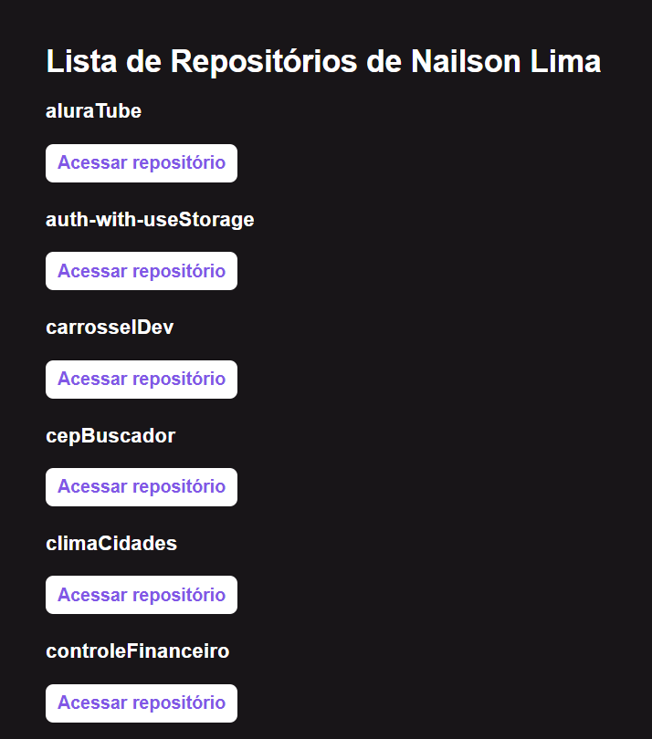

# Github searcher - Primeira parte da trilha ignite de react da Rocketseat❤
Aplicação que faz uam listagem dos meus repósitorios pessoais. 

## 📃 Index:

## 🛠️ Construído com:

* [ ReactJs ](https://pt-br.legacy.reactjs.org/) - ReactJs.
* [ NextJS ](https://nextjs.org/) - NextJs.
* [ TypeScript ](https://www.typescriptlang.org/) - TypeScript.

## ✒️ Autores

* **Nailson** - [Dev](https://github.com/nailsonlima)

## 🎁 Expressões de gratidão

* Obrigado pelo seu tempo!

---
Feito com ❤️ por [Nailson Lima](https://gist.github.com/nailsonlima)
